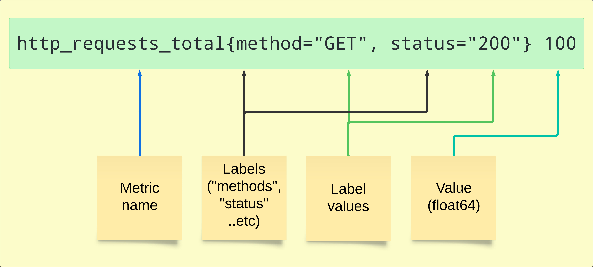
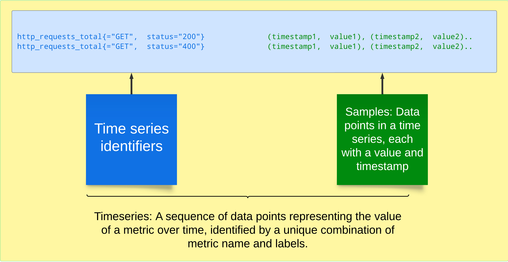
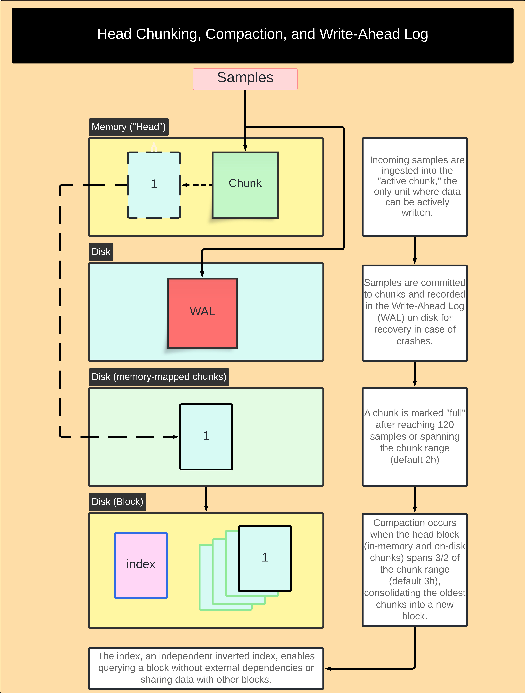
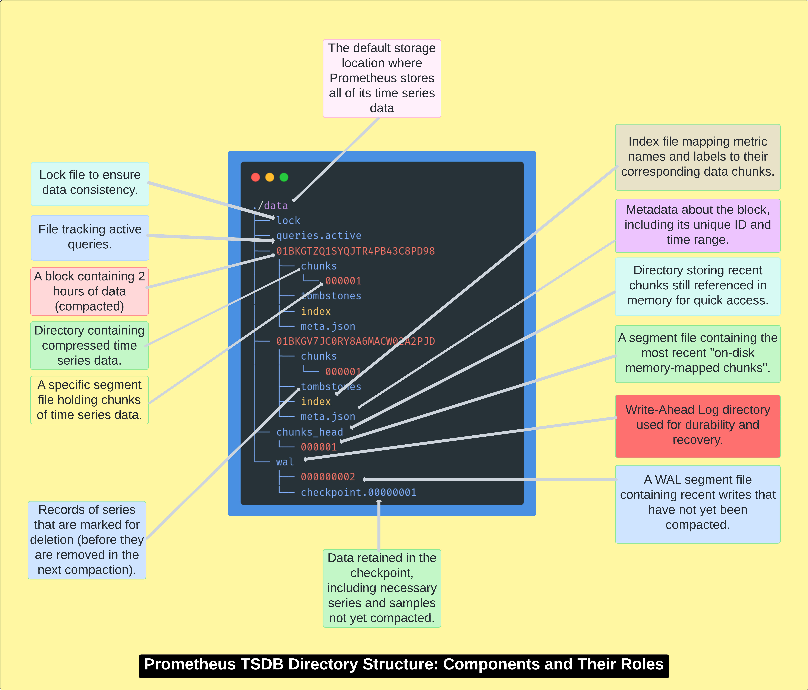
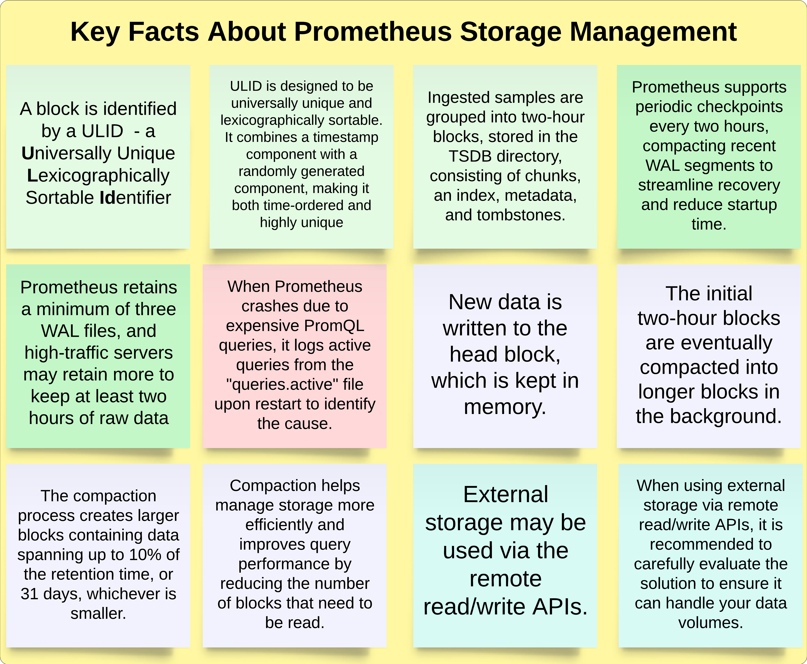
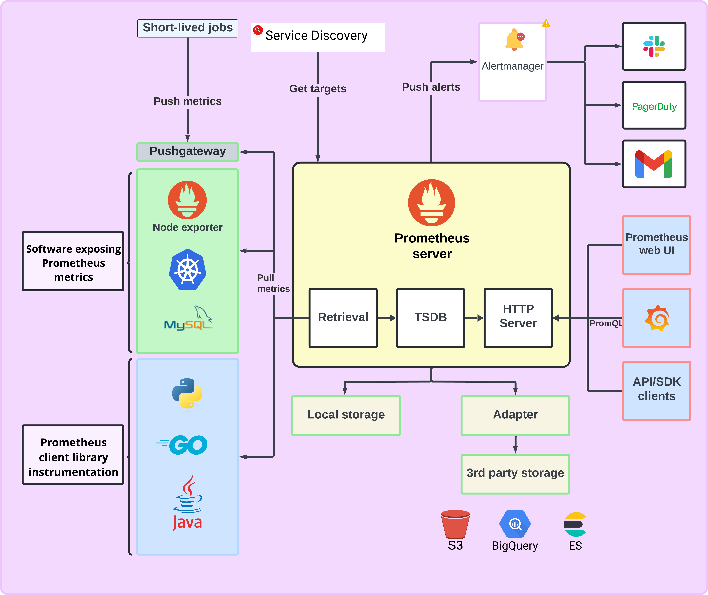

# Understanding Prometheus: Internals and Architecture


## How Does Prometheus Work?


### Scraping Metrics: The Pull Model and Exposition Format


```bash
http_requests_total{method="GET", status="200"} 100
http_requests_total{method="GET", status="200"} 20
http_requests_total{method="GET", status="200"} 140
http_requests_total{method="GET", status="200"} 10
```






### Data Storage: Head Chunking, Compaction, and Write-Ahead Log








### Querying Data: PromQL and the Expression Browser


### Rules and Alerts


### Visualization: Prometheus UI and Grafana


## Prometheus Architecture


### Prometheus Server


### Pushgateway


### Exporters


### Storage Solutions


### Prometheus User Interfaces

