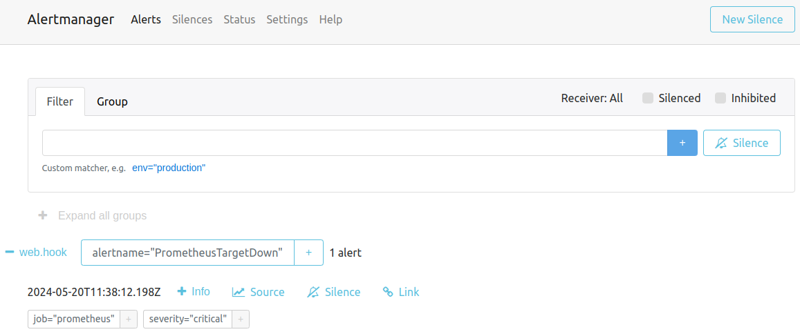
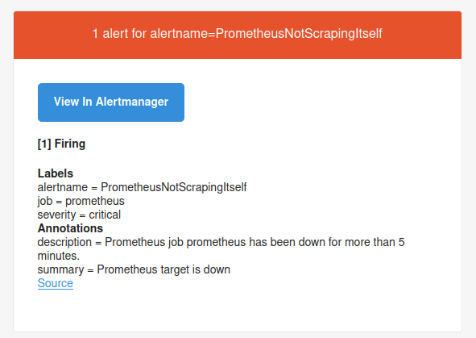
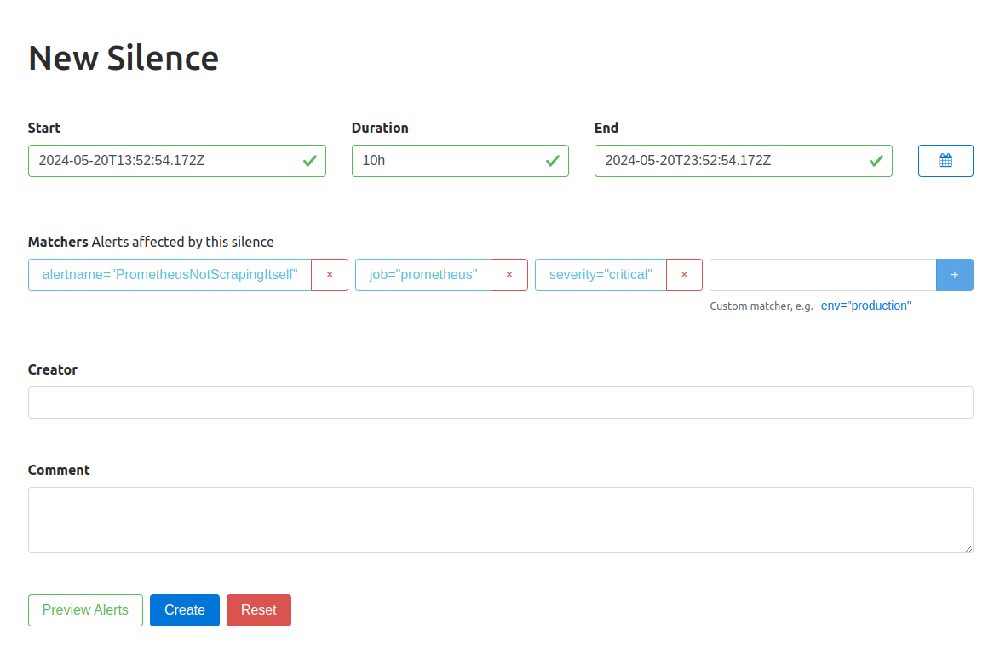
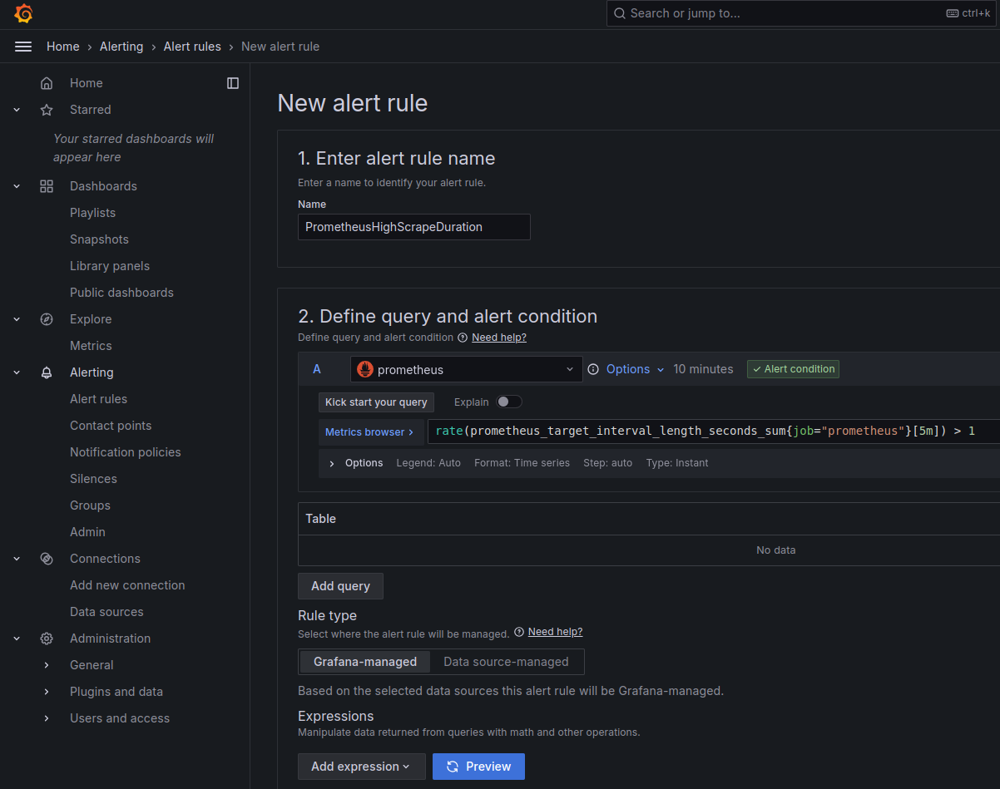
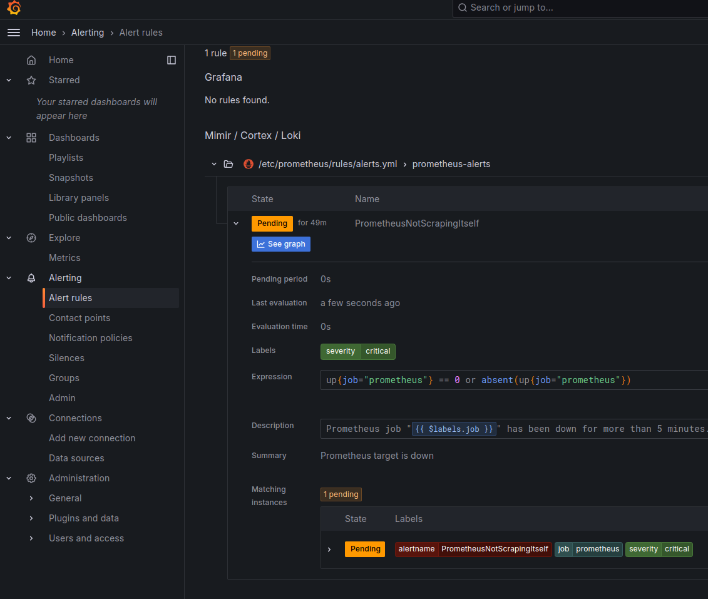

# Alertmanager: Rules, Receivers, and Grafana Integration


## Alerting Rules


```bash
rule_files:
  - /etc/prometheus/rules/alerts.yml
```


```bash
global:
  scrape_interval: 15s

scrape_configs:
  - job_name: prometheus
    static_configs:
      - targets: ['localhost:9090']  
```


```yaml
cat << EOF > /etc/prometheus/prometheus.yml
# Global configuration
global:
  scrape_interval: 15s

# A scrape configuration containing exactly one endpoint to scrape:
scrape_configs:
  - job_name: prometheus
    static_configs:
      - targets: ['localhost:9090']

# Alerting rules
rule_files:
  - /etc/prometheus/rules/alerts.yml

# Alertmanager configuration
alerting:
  alertmanagers:
    - static_configs:
      - targets:
        - localhost:9093
EOF
```


```bash
kill -HUP $(pgrep prometheus)
```


```bash
# Create the directory structure
mkdir -p /etc/prometheus/rules
```


```yaml
# /etc/prometheus/prometheus.yml
[...]
scrape_configs:
  # The job name is "prometheus"
  - job_name: prometheus 
    static_configs:
      - targets: ['localhost:9090']
[...]      
```


```yaml
cat << EOF > /etc/prometheus/rules/alerts.yml
groups:
  - name: prometheus-alerts
    rules:
      # Alert if Prometheus is not able to scrape its own metrics
      - alert: PrometheusNotScrapingItself
        expr: up{job="prometheus"} == 0 or absent(up{job="prometheus"})
        for: 5m
        labels:
          severity: critical
        annotations:
          summary: "Prometheus target is down"
          description: >-            
            Prometheus job \\"{{ \$labels.job }}\\" 
            has been down for more than 5 minutes.
EOF
```


```bash
sed -i \
's/job_name: prometheus/job_name: prometheus2/g' \
/etc/prometheus/prometheus.yml
```


```bash
kill -HUP $(pgrep prometheus)
kill -HUP $(pgrep alertmanager)
```


```bash
echo "http://$PROMETHEUS_IP:9093"
```

  
```bash
max_time = scrape_interval + evaluation_interval + for_time + group_wait + any_extra_time
```




```bash
echo "http://$PROMETHEUS_IP:9090/alerts"
```


```bash
sed -i \
's/job_name: prometheus2/job_name: prometheus/g' \
/etc/prometheus/prometheus.yml
```


```bash
kill -HUP $(pgrep prometheus)
```


```yaml
groups:
  - name: prometheus-alerts
    rules:
      # Alert if Prometheus is not able to scrape its own metrics
      - alert: PrometheusNotScrapingItself
        expr: up{job="prometheus"} == 0 or absent(up{job="prometheus"})
        for: 5m
        labels:
          severity: critical
        annotations:
          summary: "Prometheus target is down"
          description: >-            
            Prometheus target (instance {{ $labels.instance }}) 
            has been down for more than 5 minutes.

      # Alert if Prometheus has no data to scrape
      - alert: PrometheusNoData
        expr: prometheus_tsdb_head_samples_appended_total == 0
        for: 5m
        labels:
          severity: warning
        annotations:
          summary: "Prometheus has no data to scrape"
          description: >-            
            Prometheus instance ({{ $labels.instance }}) 
            has not scraped any data for more than 5 minutes.

      # Alert if Prometheus memory usage is high
      - alert: PrometheusHighMemoryUsage
        expr: process_resident_memory_bytes{job="prometheus"} > 5000000000
        for: 5m
        labels:
          severity: warning
        annotations:
          summary: "Prometheus memory usage is high"
          description: >-
            Prometheus instance ({{ $labels.instance }}) 
            is using more than 5GB of memory.

      # Alert if Prometheus is experiencing high CPU usage
      - alert: PrometheusHighCPUUsage
        expr: rate(process_cpu_seconds_total{job="prometheus"}[5m]) > 0.85
        for: 5m
        labels:
          severity: warning
        annotations:
          summary: "Prometheus CPU usage is high"
          description: >-
            Prometheus instance ({{ $labels.instance }}) 
            is using more than 85% of CPU for the last 5 minutes.

      # Alert if Prometheus has high scrape duration
      - alert: PrometheusHighScrapeDuration
        expr: rate(prometheus_target_interval_length_seconds_sum{job="prometheus"}[5m]) > 1
        for: 5m
        labels:
          severity: critical
        annotations:
          summary: "Prometheus high scrape duration"
          description: >-
            Prometheus instance ({{ $labels.instance }}) 
            has a high scrape duration over the last 5 minutes.

      # Alert if Prometheus has a large number of series in the TSDB
      - alert: PrometheusHighSeriesCount
        expr: prometheus_tsdb_head_series > 1000000
        for: 5m
        labels:
          severity: warning
        annotations:
          summary: "Prometheus TSDB high series count"
          description: >-
            Prometheus instance ({{ $labels.instance }}) 
            has more than 1,000,000 active time series.
```


```yaml
- alert: MyAlert
  expr: my_metric > 100
  for: 5m
  labels:
    severity: warning
    value: "{{ $value }}"
  annotations:
    summary: "The value of my_metric is high"
    description: "The value of my_metric is {{ $value }}"
```


## Alertmanager Receivers


```yaml
route:
  group_by: ['alertname']
  group_wait: 30s
  group_interval: 5m
  repeat_interval: 20m
  # define a receiver
  receiver: 'email-me'

receivers:
  - name: 'email-me'
    email_configs:
    - to: '$SMTP_TO'
      from: '$SMTP_FROM'
      smarthost: '$SMTP_SERVER:$SMTP_PORT'
      auth_username: '$SMTP_USER'
      auth_identity: '$SMTP_USER'
      auth_password: '$SMTP_PASS'
```


```bash
export SMTP_SERVER="<smtp_server>"
export SMTP_PORT="<smtp_port>"
export SMTP_USER="<your_email>"
export SMTP_PASS="<your_password>"
export SMTP_FROM="<your_email>"
export SMTP_TO="<recipient_email>"
```


```yaml
cat << EOF > /etc/alertmanager/alertmanager.yml
route:
  group_by: ['alertname']
  group_wait: 30s
  group_interval: 5m
  repeat_interval: 20m
  # define a receiver
  receiver: 'email-me'

receivers:
  - name: 'email-me'
    email_configs:
    - to: '$SMTP_TO'
      from: '$SMTP_FROM'
      smarthost: '$SMTP_SERVER:$SMTP_PORT'
      auth_username: '$SMTP_USER'
      auth_identity: '$SMTP_USER'
      auth_password: '$SMTP_PASS'
EOF
```


```bash
systemctl restart alertmanager
```




```yaml
route:
  group_wait: 10s
  group_interval: 10s
  repeat_interval: 30m

  receiver: "slack"
  
  # Child routes
  routes:
    - receiver: "slack"
      match_re:
        # Send this alert to the Slack receiver 
        # Only if the severity is warning or critical
        severity: critical|warning
      # Continue to the next route
      continue: true

    - receiver: "webhook"
      match_re:
        severity: critical

receivers:
  - name: "slack"
    slack_configs:
      - api_url: 'https://hooks.slack.com/services/xxx/xxx/xxx'
        # Whether to notify about resolved alerts.
        send_resolved: true
        channel: 'monitoring'
        text: "{{ range .Alerts }}<!channel> {{ .Annotations.summary }}\n{{ .Annotations.description }}\n{{ end }}"

  - name: "webhook"
    webhook_configs:
      - url: http://my-webhook-url:8080/alert
        send_resolved: false          
```


## Silencing Alerts




## Grafana Alerting vs. Prometheus Alerting






### Choosing Between Prometheus and Grafana for Alerting