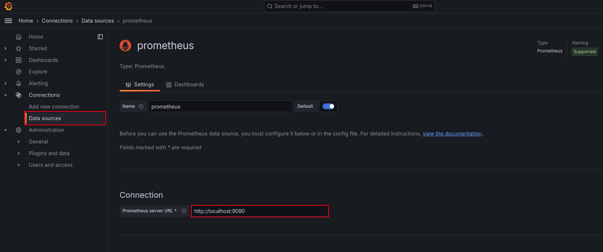
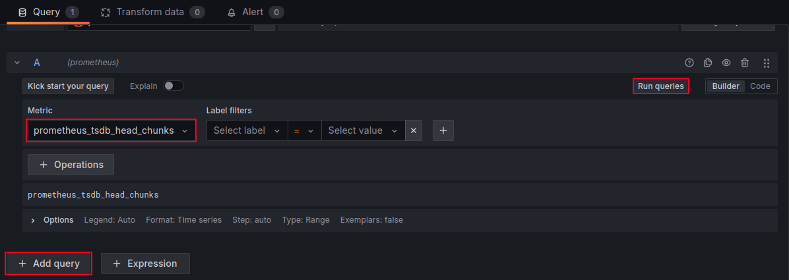
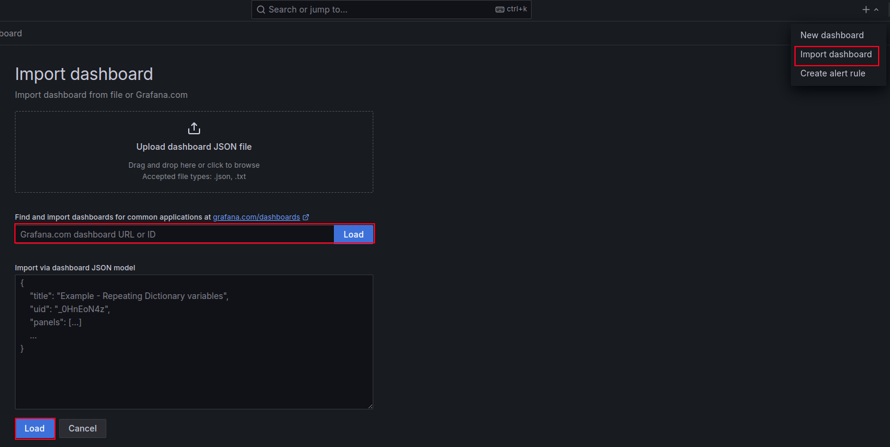
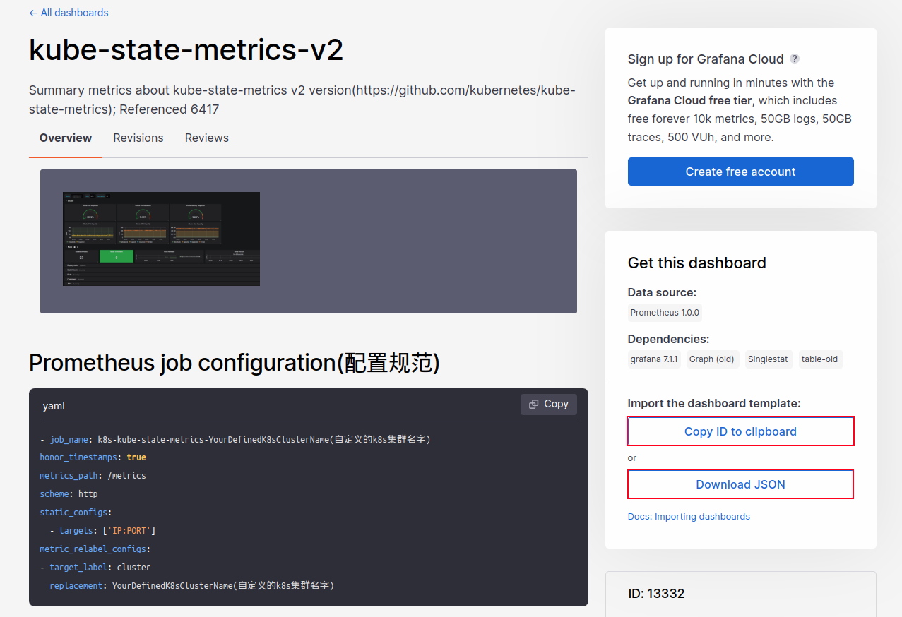
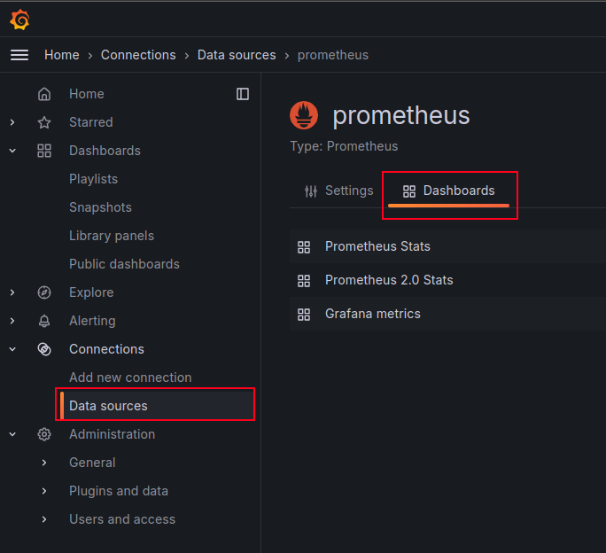
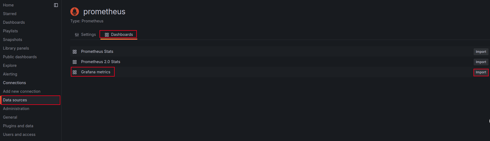

# Integrating Prometheus with Grafana


## A User-Unfriendly Web UI: A Blessing not a Curse


## What is Grafana?


## Deploying Grafana


```bash
# Update the package list
apt-get update

# Install the necessary dependencies
apt-get install -y \
apt-transport-https \
software-properties-common wget

# Create the directory for the Grafana GPG key
mkdir -p /etc/apt/keyrings/

# Import the Grafana GPG key
wget -q -O - \
https://apt.grafana.com/gpg.key | \
gpg --dearmor | \
tee /etc/apt/keyrings/grafana.gpg \
> /dev/null
```


```bash
# Add the Grafana repository to the system
echo \
"deb [signed-by=/etc/apt/keyrings/grafana.gpg] \
https://apt.grafana.com stable main" | \
tee -a /etc/apt/sources.list.d/grafana.list \
> /dev/null

# Update the package list
apt-get update
```


```bash
# You can find the versions available for installation by running the following command:
# apt-cache madison grafana
apt-get install grafana=11.0.0 -y
```


```bash
systemctl daemon-reload
systemctl start grafana-server
```

    
```bash
systemctl enable grafana-server
```


```bash
echo "http://$(curl -s ifconfig.me):3000"
```


## Adding Prometheus as a Data Source




## Adding Prometheus Dashboards


### Creating Dashboards from Scratch




### Importing Dashboards from the Grafana Community






### Using Pre-built Dashboards




## Monitoring Grafana and Prometheus with Prometheus


```bash
curl http://localhost:3000/metrics
```


```yaml
cat <<EOF | sudo tee -a /etc/prometheus/prometheus.yml
  - job_name: 'grafana'
    static_configs:
      - targets: ['localhost:3000']
EOF
```


```yaml
global:
  scrape_interval: 5s

scrape_configs:
  - job_name: 'prometheus'
    static_configs:
      - targets: ['localhost:9090']
  - job_name: 'grafana'
    static_configs:
      - targets: ['localhost:3000']
```


```bash
promtool check config /etc/prometheus/prometheus.yml
```


```bash
kill -HUP $(pgrep prometheus)
```

