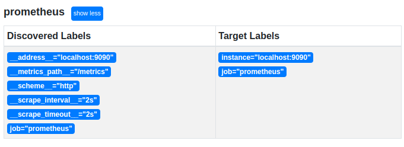

# Relabeling in Prometheus


## Understanding Relabeling


```yaml
cat <<EOF > /etc/prometheus/prometheus.yml
global:
  scrape_interval: 2s
scrape_configs:
  - job_name: prometheus
    static_configs:
      - targets: ['localhost:9090']
EOF
```


```bash
# You can execute the following command to get the URL of the "Service Discovery" page
echo http://$(curl -s ifconfig.me):9090/service-discovery
```




## Target, Metric, Write, and Alert Relabeling: What's the Difference?


### relabel_configs


### metric_relabel_configs


### write_relabel_configs


### alert_relabel_configs