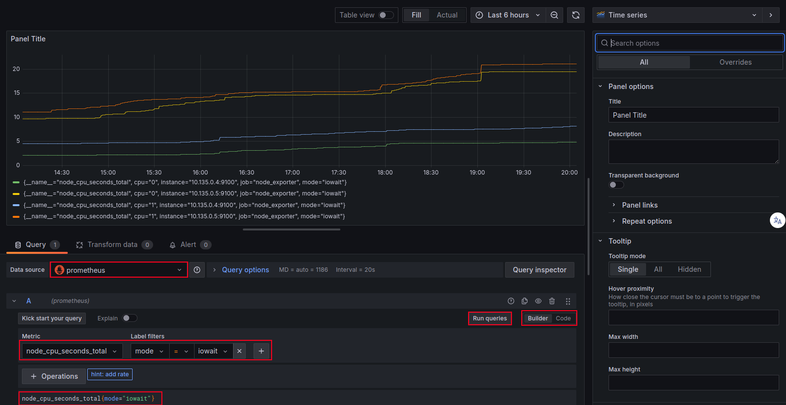
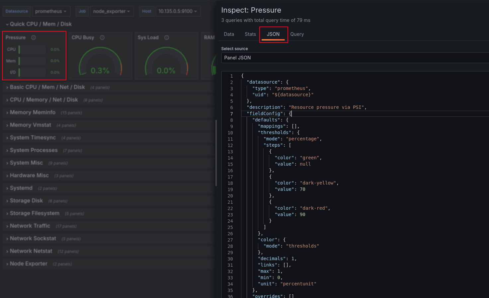
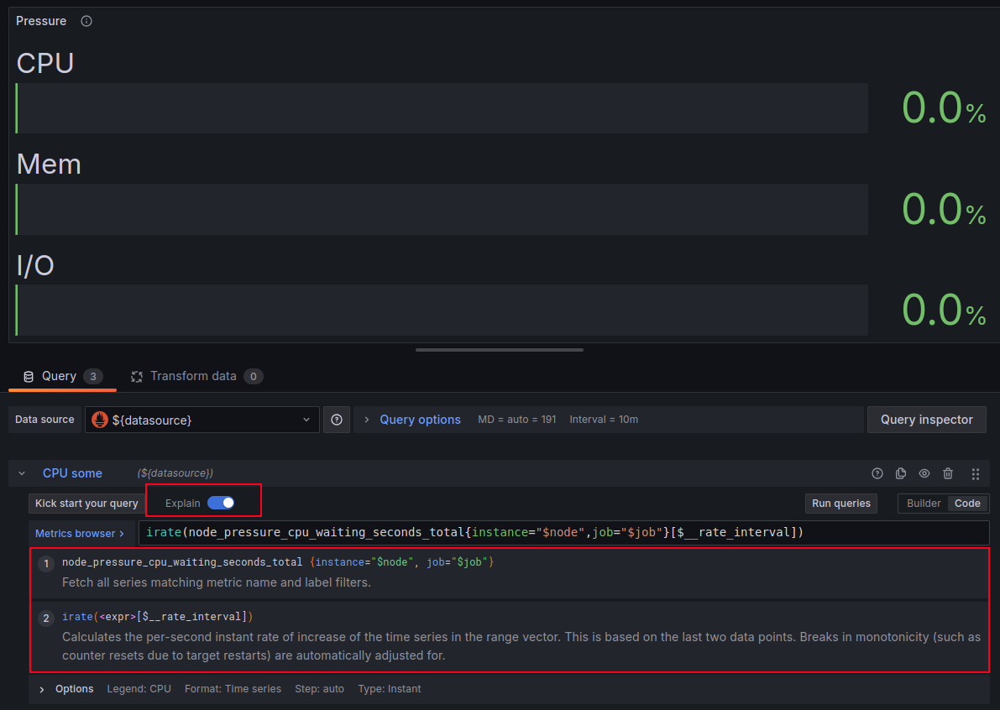

# Building Grafana Dashboards for Node Exporter Metrics


## Building Custom Dashboards




```bash
rate(
  node_cpu_seconds_total{
    mode="iowait"
  }[5m]
)
```


## The Node Exporter Full Dashboard




```bash
irate(
  node_pressure_cpu_waiting_seconds_total{
    instance="$node",
    job="$job"
  }[$__rate_interval]
)
```

