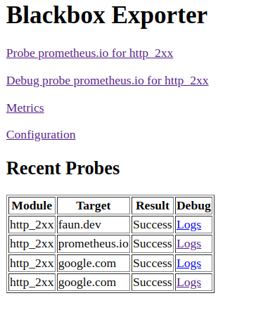
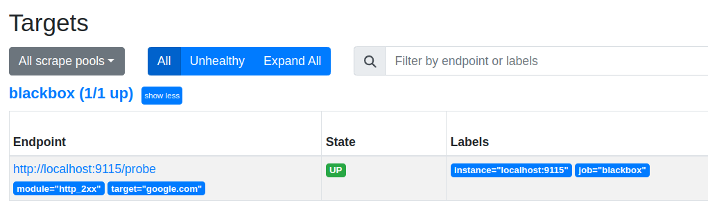
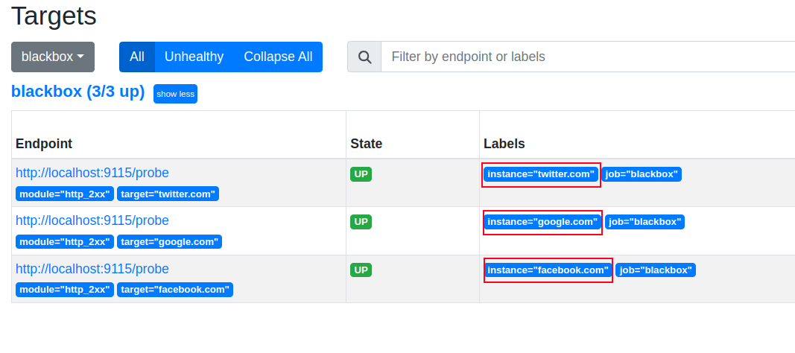

# Monitoring Endpoints with Prometheus and Blackbox Exporter


## Your First Steps with the Blackbox Exporter


```bash
curl http://localhost:9115/metrics
```


```yaml
# Define the modules to use
modules:
  # Create a module called http_2xx
  http_2xx:
    # Configure the prober to use the http module
    # The http prober probes a HTTP or HTTPS endpoint
    prober: http
```


```bash
curl "http://localhost:9115/probe?target=google.com&module=http_2xx"
```


```bash
# HELP probe_dns_lookup_time_seconds Returns the time taken for probe dns lookup in seconds
# TYPE probe_dns_lookup_time_seconds gauge
probe_dns_lookup_time_seconds 0.000862674
# HELP probe_duration_seconds Returns how long the probe took to complete in seconds
# TYPE probe_duration_seconds gauge
probe_duration_seconds 0.001254561
# HELP probe_failed_due_to_regex Indicates if probe failed due to regex
# TYPE probe_failed_due_to_regex gauge
probe_failed_due_to_regex 0
# HELP probe_http_content_length Length of http content response
# TYPE probe_http_content_length gauge
probe_http_content_length 0
# HELP probe_http_duration_seconds Duration of http request by phase, summed over all redirects
# TYPE probe_http_duration_seconds gauge
probe_http_duration_seconds{phase="connect"} 0
probe_http_duration_seconds{phase="processing"} 0
probe_http_duration_seconds{phase="resolve"} 0.000862674
probe_http_duration_seconds{phase="tls"} 0
probe_http_duration_seconds{phase="transfer"} 0
[...]
[...]
# HELP probe_ip_protocol Specifies whether probe ip protocol is IP4 or IP6
# TYPE probe_ip_protocol gauge
probe_ip_protocol 6
# HELP probe_success Displays whether or not the probe was a success
# TYPE probe_success gauge
probe_success 0
```


```bash
cat <<EOF > /etc/prometheus/blackbox.yml
modules:
  http_2xx:
    prober: http
    http:
      preferred_ip_protocol: "ip4"
EOF
```


```bash
docker restart blackbox_exporter
```


```bash
curl -s "http://localhost:9115/probe?target=google.com&module=http_2xx" | \
grep -E "^probe_success|^probe_ip_protocol" || echo "Probe failed"
```


```bash
probe_ip_protocol 4
probe_success 1
```


```yaml
modules:
  probe_2xx:
    prober: http
    http:
      preferred_ip_protocol: "ip4"
```


```bash
curl -s "http://localhost:9115/probe?target=google.com&module=probe_2xx"
```


## Debugging the Probe


```bash
curl -s "http://localhost:9115/probe?target=google.com&module=http_2xx&debug=true"
```


```bash
echo http://$(curl -s ifconfig.me):9115/
```




## Integrating the Blackbox Exporter with Prometheus


```yaml
cat <<EOF > /etc/prometheus/prometheus.yml
scrape_configs:
  - job_name: 'blackbox'
    metrics_path: /probe
    params:
      module: [http_2xx]
      target: ['google.com']
    static_configs:
      - targets:
        - localhost:9115
EOF
```


```text
http://<static_configs.targets>/<metrics_path>?module=<params.module>&target=<params.target>
```


```bash
http://localhost:9115/probe?module=http_2xx&target=google.com
```


```bash
kill -HUP $(pgrep prometheus)
```




```yaml
  - job_name: 'blackbox'
    metrics_path: /probe
    params:
      module: [http_2xx]
      target: ['google.com', 'facebook.com', 'twitter.com']
    static_configs:
      - targets:
        - localhost:9115
```


```bash
# Is this the result of the probe for google.com, facebook.com or twitter.com?
probe_http_duration_seconds{instance="localhost:9115",phase="connect"} 0.008696507000000001
# Same question here!
probe_http_duration_seconds{instance="localhost:9115",phase="connect"} 0.004812664198761231
# ...
```


```yaml
  - job_name: 'blackbox'
    metrics_path: /probe
    params:
      module: [http_2xx]
    static_configs:
      - targets:
        # Add the target URLs here
        - google.com
    relabel_configs:
      # Copy the value of the `targets` label to the `__param_target` label
      - source_labels: [__address__]
        target_label: __param_target
      # Copy the value of the `__param_target` label to the `instance` label
      - source_labels: [__param_target]
        target_label: instance
      # Replace the value of the `__address__` label with `localhost:9115`
      - target_label: __address__
        replacement: localhost:9115
```


```yaml
  - job_name: 'blackbox'
    metrics_path: /probe
    params:
      module: [http_2xx]
    static_configs:
      - targets:
        # Add more target URLs here
        - google.com
        - facebook.com
        - twitter.com
    relabel_configs:
      # Copy the value of the `targets` label to the `__param_target` label
      - source_labels: [__address__]
        target_label: __param_target
      # Copy the value of the `__param_target` label to the `instance` label
      - source_labels: [__param_target]
        target_label: instance
      # Replace the value of the `__address__` label with `localhost:9115`
      - target_label: __address__
        replacement: localhost:9115
```


```bash
http://google.com/probe?target=http://google.com&module=http_2xx
# ...and so on for facebook.com and twitter.com
```


```bash
probe_http_duration_seconds{instance="localhost:9115",phase="connect"} 0.008
# ..etc
```


```bash
probe_http_duration_seconds{instance="google.com",phase="connect"} 0.008
```


```bash
http://localhost:9115/probe?target=http://google.com&module=http_2xx
# ...and so on for facebook.com and twitter.com
```


```yaml
cat <<EOF > /etc/prometheus/prometheus.yml && kill -HUP $(pgrep prometheus)
scrape_configs:
  - job_name: 'blackbox'
    metrics_path: /probe
    params:
      module: [http_2xx]
    static_configs:
      - targets:
        - google.com
        - facebook.com
        - twitter.com
    relabel_configs:        
      - source_labels: [__address__]
        target_label: __param_target
      - source_labels: [__param_target]
        target_label: instance
      - target_label: __address__
        replacement: 127.0.0.1:9115
EOF
```




```text
probe_success{job="blackbox"}
```