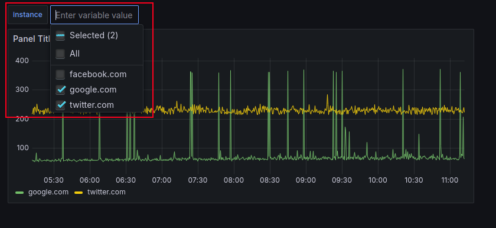

# Black Box Exporter: Building User-Friendly Grafana Dashboard


```yaml
cat <<EOF > /etc/prometheus/blackbox.yml
modules:
  http_2xx:
    prober: http
    http:
      preferred_ip_protocol: "ip4"
EOF
```


```yaml
cat <<EOF > /etc/prometheus/prometheus.yml && \
kill -HUP $(pgrep prometheus) && \
docker restart blackbox_exporter
scrape_configs:
  - job_name: 'blackbox'
    metrics_path: /probe
    params:
      module: [http_2xx]
    static_configs:
      - targets:
        - google.com
        - facebook.com
        - twitter.com
    relabel_configs:
      - source_labels: [__address__]
        target_label: __param_target
      - source_labels: [__param_target]
        target_label: instance
      - target_label: __address__
        replacement: localhost:9115
EOF
```


```bash
curl -s "http://localhost:9115/probe?target=google.com&module=http_2xx" | \
grep probe_http_duration_seconds | \
grep -v "#"
```


```bash
probe_http_duration_seconds{phase="connect"} <value>
probe_http_duration_seconds{phase="processing"} <value>
probe_http_duration_seconds{phase="resolve"} <value>
probe_http_duration_seconds{phase="tls"} <value>
probe_http_duration_seconds{phase="transfer"} <value>
```


```bash
sum by (instance) (
  probe_http_duration_seconds
)
```


```bash
{instance="twitter.com"} 0.37723951
{instance="facebook.com"} 0.465827366
{instance="google.com"} 0.068915492
```


```bash
sum by (instance) (
  probe_http_duration_seconds{
    instance="google.com"
  }
)
```


```bash
sum by (instance) (
  probe_http_duration_seconds{
    instance=~"$instance"
  }
)
```


```bash
sum by (instance) (
  probe_http_duration_seconds{
    instance=~"$instance"
  } * 1000
)
```


```bash
sum by (instance) (
  probe_http_duration_seconds{
    instance=~"$instance"
  } * 1000
)
```





```bash
sum by (instance) (
  probe_http_duration_seconds{
    instance=~"$instance", 
    phase=~"$phase"
  } * 1000
)
```


