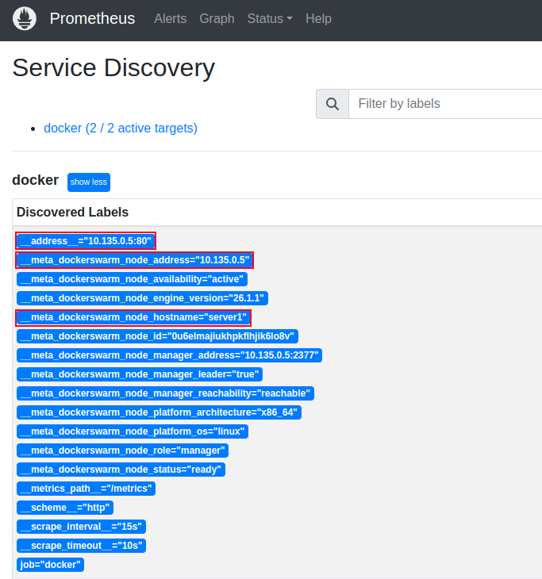
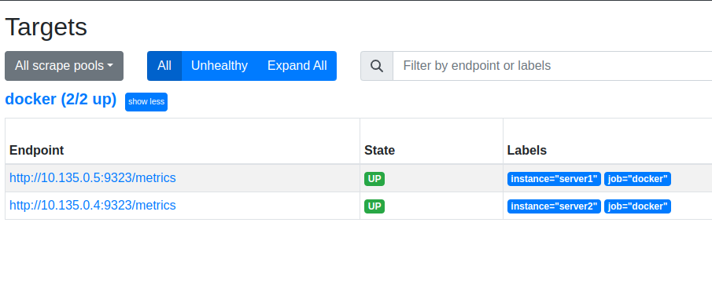
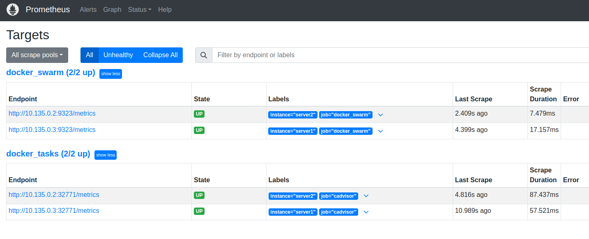

# Monitoring Docker Swarm with Prometheus


## Installation and Initial Configurations


```bash
export server1=<server1-ip>
```


```bash
docker swarm init --advertise-addr $server1
```


```bash
# Install Docker on server2 if it's not already installed
curl -fsSL https://get.docker.com | sh

# Join the cluster
docker swarm join --token SWMTKN-1-xxx-xxx <server1-ip>:2377
```


```bash
export server1=<server1-ip>
export DOCKER_METRICS_ADDR=$server1:9323
```


```bash
cat <<EOF > /etc/docker/daemon.json
{
  "metrics-addr" : "${DOCKER_METRICS_ADDR}",
  "experimental" : true,
  "hosts": ["unix:///var/run/docker.sock", "tcp://$server1:2376"]
}
EOF
```


```bash
[...]
#ExecStart=/usr/bin/dockerd -H fd:// --containerd=/run/containerd/containerd.sock
ExecStart=/usr/bin/dockerd --containerd=/run/containerd/containerd.sock
[...]
```


```bash
sed -i \
  '/^ExecStart=/c\ExecStart=/usr/bin/dockerd  --containerd=/run/containerd/containerd.sock' \
  /lib/systemd/system/docker.service
```


```bash
systemctl daemon-reload
systemctl restart docker
```


```bash
curl http://${DOCKER_METRICS_ADDR}/metrics
```


```bash
curl -s http://$server1:2376/info | jq
```


```bash
# Inspect swarm
curl -s http://$server1:2376/swarm | jq
# List the containers
curl -s http://$server1:2376/tasks | jq
# List the services
curl -s http://$server1:2376/services | jq
# List the nodes
curl -s http://$server1:2376/nodes | jq
# ...etc
```


## Configuring Prometheus


```bash
export server1=<server1-ip>
```


```yaml
cat <<EOF > /etc/prometheus/prometheus.yml && kill -HUP $(pgrep prometheus)
global:
  scrape_interval: 15s

scrape_configs:
  - job_name: 'docker_swarm'
    dockerswarm_sd_configs:
      - host: http://$server1:2376
        role: nodes

    relabel_configs:

      # First action: Use the node address as the target address
      - action: replace
        source_labels: [__meta_dockerswarm_node_address]
        target_label: __address__
        replacement: \$1:9323

      # Second action: Use the node hostname as the instance label
      - action: replace
        source_labels: [__meta_dockerswarm_node_hostname]
        target_label: instance
EOF
```




```bash
export server2=<server2-ip>
```


```bash
export DOCKER_METRICS_ADDR=$server2:9323
```


```bash
cat <<EOF > /etc/docker/daemon.json
{
  "metrics-addr" : "${DOCKER_METRICS_ADDR}",
  "experimental" : true
}
EOF
```


```bash
systemctl restart docker
```


```bash
export server2=<server2-ip>
curl http://${server2}:9323/metrics
```




```bash
systemctl restart prometheus
```


```bash
docker service create \
  --name cadvisor \
  -l prometheus-job=cadvisor \
  --mode=global \
  --publish target=8080,mode=host \
  --mount type=bind,src=/var/run/docker.sock,dst=/var/run/docker.sock,ro \
  --mount type=bind,src=/,dst=/rootfs,ro \
  --mount type=bind,src=/var/run,dst=/var/run \
  --mount type=bind,src=/sys,dst=/sys,ro \
  --mount type=bind,src=/var/lib/docker,dst=/var/lib/docker,ro \
  gcr.io/cadvisor/cadvisor \
  --docker_only=false
```


```bash
curl http://$server1:8080/metrics
```


```yaml
cat <<EOT > /etc/prometheus/prometheus.yml && kill -HUP $(pgrep prometheus)
global:
  scrape_interval: 15s

scrape_configs:
  - job_name: 'docker_tasks'
    dockerswarm_sd_configs:
      - host: http://$server1:2376
        role: tasks
    
    relabel_configs:

      # Only keep containers that have a desired state of running.
      - action: keep 
        source_labels: [__meta_dockerswarm_task_desired_state]
        regex: running
        
      # Only keep containers that have a prometheus-job label.
      - action: keep
        source_labels: [__meta_dockerswarm_service_label_prometheus_job]
        regex: .+
        
      # Use the prometheus-job Swarm label as Prometheus job label.
      - action: replace
        source_labels: [__meta_dockerswarm_service_label_prometheus_job]
        target_label: job

      # set the instance label to the node name
      - action: replace
        source_labels: [__meta_dockerswarm_node_hostname]
        target_label: instance
EOT
```


```yaml
cat <<EOT > /etc/prometheus/prometheus.yml && kill -HUP $(pgrep prometheus)
global:
  scrape_interval: 15s

scrape_configs:
  - job_name: 'docker_swarm'
    dockerswarm_sd_configs:
      - host: http://$server1:2376
        role: nodes
    relabel_configs:
      # Use the node address as the target address
      - source_labels: [__meta_dockerswarm_node_address]
        target_label: __address__
        replacement: \$1:9323
      # Use the node hostname as the instance label
      - source_labels: [__meta_dockerswarm_node_hostname]
        target_label: instance
  - job_name: 'docker_tasks'
    dockerswarm_sd_configs:
      - host: http://$server1:2376
        role: tasks
    relabel_configs:
      # Only keep containers that should be running.
      - source_labels: [__meta_dockerswarm_task_desired_state]
        regex: running
        action: keep
      # Only keep containers that have a prometheus-job label.
      - source_labels: [__meta_dockerswarm_service_label_prometheus_job]
        regex: .+
        action: keep
      # Use the prometheus-job Swarm label as Prometheus job label.
      - source_labels: [__meta_dockerswarm_service_label_prometheus_job]
        target_label: job
      # set the instance label to the node name
      - source_labels: [__meta_dockerswarm_node_hostname]
        target_label: instance
EOT
```




```bash
curl -sSL https://raw.githubusercontent.com/dockersamples/example-voting-app/refs/heads/main/docker-stack.yml | \
  docker stack deploy -c - vote
```


```yaml
# reminder:
- action: keep
  source_labels: [__meta_dockerswarm_task_desired_state]
  regex: running
- action: keep
  source_labels: [__meta_dockerswarm_service_label_prometheus_job]
  regex: .+
```


```bash
# List all services launched by the vote stack
# then add the prometheus-job label to each of them
docker service ls --filter label=com.docker.stack.namespace=vote -q | \
  xargs -I {} docker service update --label-add prometheus-job=vote {}
```


```sql
count(
  container_last_seen{
    container_label_com_docker_swarm_service_id!=""
  }
)
```


```sql
count(
  container_last_seen{
    container_label_com_docker_swarm_service_id=~".+"
  }
) by (container_label_com_docker_swarm_service_name)
```


```sql
sum(
  rate(
    container_cpu_usage_seconds_total{
      name=~".+"
    }[5m]
  )
) by (name) * 100
```


```sql
sum(
  container_memory_rss{
    name=~".+"
  }
) by (name)
```


```sql
sum(
  rate(
    container_network_receive_bytes_total{
      name=~".+"
    }[5m]
  )
) by (name)
```


```sql
sum(
  rate(
    container_network_receive_bytes_total{
      name=~".+"
    }[5m]
  )
) by (container_label_com_docker_swarm_service_name)
```


## Security Aspects