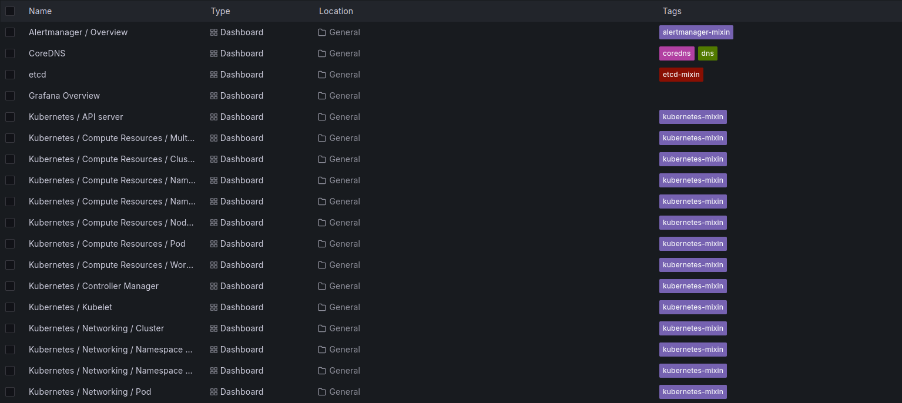

# Using Prometheus to Monitor Kubernetes: Grafana and Prometheus Operator


## Do Not Reinvent the Wheel


### Prometheus Operator


### kube-prometheus


### kubernetes-mixin


### kube-prometheus-stack


## An All-in-One Kubernetes Monitoring with Prometheus


```bash
# Add the Prometheus Helm repository
helm repo add \
    prometheus-community \
    https://prometheus-community.github.io/helm-charts

# Update the Helm repositories
helm repo update

# Install the kube-prometheus-stack
helm upgrade --install \
    kube-prometheus-stack \
    prometheus-community/kube-prometheus-stack
```


```bash
helm show values prometheus-community/kube-prometheus-stack
```


```yaml
prometheus:
  prometheusSpec:
    remoteWrite:
      - url: "http://my-remote-write-url:9090/write"
        name: "my-remote-write"
        basicAuth:
          username: "my-username"
          password: "my-password"
      # Add more remote write configurations
      - url: "http://my-remote-write-url:9090/write"
        name: "my-remote-write-2"
      - url: "http://my-remote-write-url:9090/write"
        name: "my-remote-write-3"
```


```yaml
prometheus:
  enabled: true
  # Enable the agent mode
  agentMode: false
```


```yaml
prometheus:
  prometheusSpec:
    remoteWrite:
      - url: "http://my-remote-write-url:9090/write"
        name: "my-remote-write"
        basicAuth:
          username: "my-username"
          password: "my-password"
    # Enable federation
    remoteRead:
      - url: "http://my-federation-url:9090/read"
        name: "my-federation-read"
```


```bash
kubectl port-forward \
    svc/kube-prometheus-stack-grafana \
    -n default \
    3000:80
```


```bash
http://127.0.0.1:3000
```


```bash
export CONTROLNODEIP=<control_node_ip>
ssh -NfL 3000:localhost:3000 root@$CONTROLNODEIP
# You can now access the Grafana dashboard 
# from your local machine on http://localhost:3000
```


```bash
kubectl get secret \
    --namespace default \
    kube-prometheus-stack-grafana \
    -o jsonpath="{.data.admin-password}" \
    | base64 --decode ; echo
```

