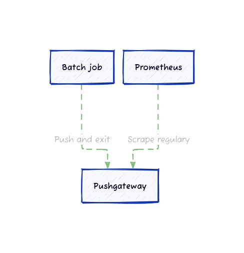

# Prometheus Pushgateway


## Introduction and Use Cases


## How it Works




## Installation and Configuration


```bash
# Download the Pushgateway from GitHub
cd $HOME
url="https://github.com/prometheus/pushgateway/releases/download/v1.8.0/pushgateway-1.8.0.linux-amd64.tar.gz"
wget $url
tar -xvf pushgateway-1.8.0.linux-amd64.tar.gz
cd pushgateway-1.8.0.linux-amd64

# Create a new user for the Pushgateway
useradd --no-create-home --shell /bin/false pushgateway

# Copy the Pushgateway binary to /usr/local/bin
cp pushgateway /usr/local/bin/pushgateway
chown pushgateway:pushgateway /usr/local/bin/pushgateway

# Create the systemd unit file
cat <<EOF > /etc/systemd/system/pushgateway.service
[Unit]
Description=Prometheus Pushgateway
Wants=network-online.target
After=network-online.target

[Service]
User=pushgateway
Group=pushgateway
Type=simple
ExecStart=/usr/local/bin/pushgateway

[Install]
WantedBy=multi-user.target
EOF

# Reload the systemd manager configuration
systemctl daemon-reload

# Start and enable the Pushgateway service
systemctl start pushgateway
systemctl enable pushgateway
```


```bash
systemctl status pushgateway
```


```bash
curl http://localhost:9091/metrics
```


## Pushing Metrics


```bash
echo "my_batch_job_duration_seconds{job=\"my_batch_job\",instance=\"localhost\"} 123" | \
    curl --data-binary \
    @- http://localhost:9091/metrics/job/my_batch_job
```


```bash
curl -s http://localhost:9091/metrics | \
    grep my_batch_job_duration_seconds
```


```bash
# TYPE my_batch_job_duration_seconds untyped
my_batch_job_duration_seconds{instance="localhost",job="my_batch_job"} 123
```


```bash
mkvirtualenv pushgateway
pip install prometheus_client==0.20.0
```


```python
cat <<EOF > push_metric.py
from prometheus_client import CollectorRegistry, Gauge, push_to_gateway

registry = CollectorRegistry()

g = Gauge(
    'my_batch_job_duration_seconds', 
    'Duration of my batch job in seconds', 
    registry=registry
)
g.set(456)

push_to_gateway('localhost:9091', job='my_batch_job', registry=registry)
EOF
```


```bash
python push_metric.py
```


```bash
curl -s http://localhost:9091/metrics | \
    grep my_batch_job_duration_seconds
```


```bash
# TYPE my_batch_job_duration_seconds gauge
my_batch_job_duration_seconds 456
```


## Configuring Prometheus to Scrape Metrics


```bash
cat <<EOF > /etc/prometheus/prometheus.yml
global:
  scrape_interval: 15s

scrape_configs:
  - job_name: 'prometheus'
    static_configs:
      - targets: ['localhost:9090']
    
  - job_name: 'pushgateway'
    static_configs:
      - targets: ['localhost:9091']
EOF
```


```bash
kill -HUP $(pidof prometheus)
```


```bash
curl -s http://localhost:9090/api/v1/targets | jq
```


```bash
# Push a metric to the Pushgateway
echo "this_is_a_test{job=\"test\",instance=\"localhost\"} 1" | \
    curl --data-binary \
    @- http://localhost:9091/metrics/job/test

# Sleep for 15 seconds to allow Prometheus to scrape the metric
sleep 15

# Query the metric from Prometheus
curl -s http://localhost:9090/api/v1/query?query=this_is_a_test | jq
```


```json
{
  "status": "success",
  "data": {
    "resultType": "vector",
    "result": [
      {
        "metric": {
          "__name__": "this_is_a_test",
          "exported_instance": "localhost",
          "exported_job": "test",
          "instance": "localhost:9091",
          "job": "pushgateway"
        },
        "value": [
          1716220300.506,
          "1"
        ]
      }
    ]
  }
}
```